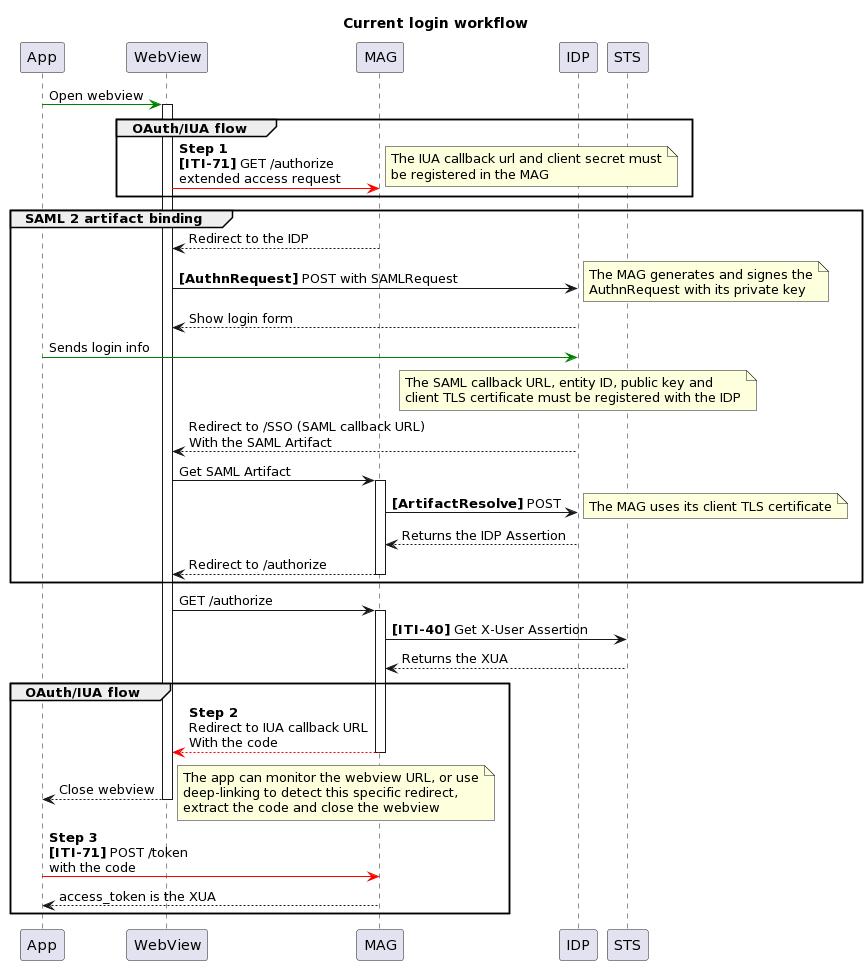

# 4. EPR Primary System Integration

## 4.1 Introduction

The REST variants of XDS transactions presented here are based on [CH EPR FHIR](https://fhir.ch/ig/ch-epr-fhir/index.html),
itself based on various IHE profiles.

<svg width="20" height="20" viewBox="0 0 64 64" xmlns="http://www.w3.org/2000/svg"><path fill="#ffce31" d="M5.9 62c-3.3 0-4.8-2.4-3.3-5.3L29.3 4.2c1.5-2.9 3.9-2.9 5.4 0l26.7 52.5c1.5 2.9 0 5.3-3.3 5.3H5.9z"/><g fill="#231f20"><path d="m27.8 23.6l2.8 18.5c.3 1.8 2.6 1.8 2.9 0l2.7-18.5c.5-7.2-8.9-7.2-8.4 0"/><circle cx="32" cy="49.6" r="4.2"/></g></svg>
Don't forget to properly encode the HTTP parameters in the queries (especially colons and pipes).
For readability, parameters are shown decoded, and the `Authorization` and `Accept` headers are omitted from the examples.

<svg width="20" height="20" viewBox="0 0 48 48" xmlns="http://www.w3.org/2000/svg"><circle cx="24" cy="24" r="21" fill="#2196F3"/><path fill="#fff" d="M22 22h4v11h-4z"/><circle cx="24" cy="16.5" r="2.5" fill="#fff"/></svg>
For HTTP GET requests, there is usually an equivalent HTTP POST request that should be supported.

## 4.2 Authentication



The sequence diagram shows the currently implemented authentication flow.

You should integrate one of the supported IDPs in your application.
The OAuth/IUA flow is supported for clients, the SAML flow is the only one implemented between the 
Mobile Access Gateway and the IDP.

Once you get the IDP SAML assertion, you can trade it for the community SAML assertion, which binds your IDP
identification to a specific patient and a purpose of use.
It is an HTTP POST request to `/assertion`, with the header `Scope` and the IDP SAML assertion as body.
The header `Scope` contains the following values:

- `purpose_of_use` (_[token][]_, required):    
a value from [EprPurposeOfUse](https://fhir.ch/ig/ch-term/ValueSet-EprPurposeOfUse.html)
- `subject_role` (_[token][]_, required):    
either `HCP`, `ASS`, `PAT` or `REP` in the system `urn:oid:2.16.756.5.30.1.127.3.10.6`
- `person_id` (_[string][]_, required):    
the patient EPR-SPID in the CX format
- `principal` (_[string][]_, only if role is `ASS`):     
the name of the healthcare professional on whose behalf an assistant is acting
- `principal_id` (_[token][]_, only if role is `ASS`):     
the GLN of the healthcare professional on whose behalf an assistant is acting
- `group` (_[string][]_, only if role is `ASS`):     
the name of the organization or group on whose behalf an assistant is acting
- `group_id` (_[token][]_, only if role is `ASS`):     
the OID of the organization or group on whose behalf an assistant is acting

```http title="Request"
--8<-- "http_getxua.txt"
```

The response then looks like:

```http title="Response"
HTTP/1.1 200 OK
Content-Type: application/json

{
  "access_token": "U0FNTGFzc2VydGlvbg",
  "token_type": "IHE-SAML",
  "expires_in": 60000,
  "scope": "resourceId/761337610445502987 purposeOfUse/NORM role/HCP"
}
```

The [base64-url](https://datatracker.ietf.org/doc/html/rfc4648#section-5) encoded SAML assertion is given in
`access_token`, and that value has to be prefixed with <code>Bearer&nbsp;</code> and inserted in an `Authorization` HTTP header for
all transactions that require it.

```http title="Example of request with the XUA"
GET /... HTTP/1.1
Authorization: Bearer U0FNTGFzc2VydGlvbg
```

## 4.3 Patient Directory

The patient directory, called the Master Patient Index (MPI), contains identifiers and demographics for all registered patients.
Identifiers include the MPI-PID and EPR-SPID, and identifiers used by primary systems that choose to share them.
Demographics include the given and family names, date of birth, gender, nationality, telecoms and address information.
It can be queried and updated.

### 4.3.1 Retrieving Patient Identifiers [ITI-83]

Patient identifiers (commonly the MPI-PID and EPR-SPID) can be queried with an
[ITI-83 (_Mobile Patient Identifier Cross-reference Query_) transaction](https://fhir.ch/ig/ch-epr-fhir/iti-83.html).

The transaction is an HTTP GET request to the endpoint `/Patient/$ihe-pix`, with the following parameters:

1. `sourceIdentifier` (_[token][]_, required):    
the known patient identifier
2. `targetSystem` (_[uri][]_, 1..2):    
to restrict the results to the EPR-SPID (required) and MPI-PID (optional)

<details><summary>Examples</summary>

```http title="Retrieve the patient's EPR-SPID using a local system identifier (1234 in the system 2.999.42)"
GET /Patient/$ihe-pix?sourceIdentifier=urn:oid:2.999.42|1234&targetSystem=urn:oid:2.16.756.5.30.1.127.3.10.3 HTTP/1.1
```

```http title="Retrieve the patient's EPR-SPID using the social security number (AHVN13/NAVS13)"
GET /Patient/$ihe-pix?sourceIdentifier=urn:oid:2.16.756.5.32|{ahvn13}&targetSystem=urn:oid:2.16.756.5.30.1.127.3.10.3 HTTP/1.1
```

```http title="Retrieve the patient's EPR-SPID using the MPI-PID"
GET /Patient/$ihe-pix?sourceIdentifier=urn:oid:2.16.756.5.30.1.191.1.0.12.3.101|{mpi-pid}&targetSystem=urn:oid:2.16.756.5.30.1.127.3.10.3 HTTP/1.1
```

```http title="Retrieve the patient's MPI-PID using the EPR-SPID"
GET /Patient/$ihe-pix?sourceIdentifier=urn:oid:2.16.756.5.30.1.127.3.10.3|{epr-spid}&targetSystem=urn:oid:2.16.756.5.30.1.127.3.10.3&targetSystem=urn:oid:2.16.756.5.30.1.191.1.0.12.3.101 HTTP/1.1
```

</details>

### 4.3.2 Patient Matching [ITI-119]

The patient's participation in the Swiss EPD can be queried with an [ITI-119 (_Patient Demographics Match_) transaction](https://fhir.ch/ig/ch-epr-fhir/iti-119.html).     
The patient data shall conform to this profile: `http://fhir.ch/ig/ch-epr-fhir/StructureDefinition/ch-pdqm-patient`.

The transaction is an HTTP POST request to the endpoint `/Patient/$match`.

There are two ways to perform the match:

1. Using a `Parameters` resource that contains the patient as an input parameter 
2. Posting the `Patient` resource directly as the body of the request

=== "1. `Parameters`"


    <details><summary>Example</summary>

    ```http title="Query with identifier (EPR-SPID)"
    --8<-- "http_iti119-eprspid.txt"
    ```

=== "2. `Patient`"

    <details><summary>Example</summary>

    ```http title="Query with family name and birthdate"
    --8<-- "http_iti119-all.txt"
    ```


### 4.3.3 Retrieving Patient Demographics

#### 4.3.3.1 Patient Read

A single patient can be retrieved by performing the transaction with the EPR-SPID specified. 
The transaction is an HTTP GET request to the endpoint `/Patient/{id}`, where `{id}` is the identifier value.

```http title="Retrieve by EPR-SPID"
GET /Patient/761337615866818761 HTTP/1.1
```

#### 4.3.3.2 Patient Search [ITI-78]

Patient demographics can also be queried with an
[ITI-78 (_Mobile Patient Demographics Query_) transaction](https://profiles.ihe.net/ITI/PDQm/ITI-78.html) (_not part of the CH EPR FHIR specification_).

The transaction to retrieve a single patient can be done by specifying patient's information. 
These search parameters can be used to search the patient:

- `family` and `given` (_[string][]_)
- `identifier` (_[token][]_)
- `telecom` (_[token][]_)
- `birthdate` (_[date][]_)
- `address` (_[string][]_): to search in any part of the address
- `address-city`,
  `address-country`,
  `address-postalcode`,
  `address-state` (_[string][]_)
- `gender` (_[token][]_)

```http title="Example with combined search parameters"
GET /Patient?family=MOHR&given=ALICE&gender=female HTTP/1.1
```

### 4.3.4 Feeding Patient Information

#### 4.3.4.1 Feed by Local PID (with EPR-SPID) [ITI-104]
Feeding patient information can be done with the [ITI-104 (_Patient Identity Feed FHIR_) transaction](https://fhir.ch/ig/ch-epr-fhir/iti-104.html).   
The following profile shall be used: `http://fhir.ch/ig/ch-epr-fhir/StructureDefinition/ch-pixm-patient-feed`.

The EPR-SPID is required as `identifier` element according the profile.
You don't have to re-specify the other identifiers, they won't be deleted if they're missing from the request.
If you want to add an identifier, you can put it in another `identifier` element.

<details><summary>Example</summary>

```http title="Add local PID by local PID"
--8<-- "http_iti104.txt"
```

</details>

#### 4.3.4.2 Feed by Local PID (without EPR-SPID)

Performing the patient information feed transaction without specifying the EPR-SPID is possible, but it is not conformant with the CH EPR FHIR specification.

<details><summary>Example</summary>

```http title="Add AHVN13 by local PID"
--8<-- "http_patidfeed.txt"
```

</details>

## 4.4 Document Directory

The document directory stores documents (in the document repository) and their metadata (in the document registry).

### 4.4.1 Searching [ITI-67]/[ITI-66]

You can search the document registry with the [ITI-67 (_Find Document References_) transaction](https://fhir.ch/ig/ch-epr-fhir/iti-67.html).

The transaction is an HTTP GET request to the endpoint `/DocumentReference`, the search parameters are described in
the [MHD ITI-67 specifications](https://profiles.ihe.net/ITI/MHD/ITI-67.html).

<details><summary>Examples</summary>

```http title="Search all documents from a patient"
GET /DocumentReference?patient.identifier=urn:oid:2.999|11111111&status=current HTTP/1.1
```

```http title="Search by class and type codes"
GET /DocumentReference?patient.identifier=urn:oid:2.999|11111111&category=http://snomed.info/sct|371531000&type=http://snomed.info/sct|419891008 HTTP/1.1
```

```http title="Search by creation date"
GET /DocumentReference?patient.identifier=urn:oid:2.999|11111111&creation=ge2023-07-10&creation=le2023-07-17 HTTP/1.1
```

</details>

You can also search for _SubmissionSets_ with the [ITI-66 (_Find Document Lists_) transaction](https://profiles.ihe.net/ITI/MHD/ITI-66.html) (_not part of the CH EPR FHIR specification_).

<details><summary>Examples</summary>

```http title="Search all by patient identifier"
GET /List?patient.identifier=urn:oid:2.999|11111111 HTTP/1.1
```

```http title="Search with additional parameters"
GET /List?patient.identifier=urn:oid:2.999|11111111&code=submissionset&status=current&designationType=http://loinc.org|1234-5 HTTP/1.1
```

</details>

### 4.4.2 Reading [ITI-68]

Retrieving a document is done with the [ITI-68 (_Retrieve Document_) transaction](https://fhir.ch/ig/ch-epr-fhir/iti-68.html).
It is a simple HTTP GET request to an URL that you will find in the linked _DocumentReference_ (that you can obtain
with search results): `DocumentReference.content.attachment.url`.

### 4.4.3 Publishing [ITI-65]

You can publish a document with the [ITI-65 (_Provide Document Bundle_) transaction](https://fhir.ch/ig/ch-epr-fhir/iti-65.html).

The transaction is an HTTP POST request to the endpoint `/`.    
The `Bundle.meta.profile` element shall have the following value: `https://profiles.ihe.net/ITI/MHD/StructureDefinition/IHE.MHD.Comprehensive.ProvideBundle`.

<details><summary>Example</summary>

```http title="Publish a PDF file"
--8<-- "http_iti65.txt"
```

</details>

### 4.4.4 Updating Metadata [CH:MHD-1]

You can update document metadata with the [CH:MHD-1 (_Update Document Metadata_) transaction](https://fhir.ch/ig/ch-epr-fhir/ch-mhd-1.html).

The transaction is an HTTP PUT request to the endpoint `/DocumentReference/{id}`, where `{id}` is the id value.

<details><summary>Example</summary>

```http title="Update metadata"
--8<-- "http_chmhd1.txt"
```

</details>

## 4.5 Professional and Organization Directory

The HPD (Healthcare Provider Directory) contains information about the healthcare professionals and organizations that
are part of the EPR.
Relationships between them (i.e. membership of professionals to organizations, or relationships between
organizations) are also available.

### 4.5.1 Searching [ITI-90]

Professionals, organizations and relationships can be queried with an
[ITI-90 (_Find Matching Care Services_) transaction](https://fhir.ch/ig/ch-epr-fhir/iti-90.html). See the
specifications for the complete list of search parameters.

=== "Professionals"

    For professionals, the endpoint is `/Practitioner`.

    ```http title="Search for 'Müller'"
    GET /Practitioner?family=Müller HTTP/1.1
    ```

    ```http title="Search by GLN"
    GET /Practitioner?identifier=urn:oid:2.51.1.3|7601000102737 HTTP/1.1
    ```

    ```http title="Retrieve from identifier"
    GET /Practitioner/DrPeterPan HTTP/1.1
    ```

=== "Organizations"

    For organizations, the endpoint is `/Organization`.

    ```http title="Search for active Organization whose name contains 'Medical'"
    GET /Organization?active=true&name:contains=Medical HTTP/1.1
    ```

    ```http title="Retrieve from identifier"
    GET /Organization/SpitalXDept3 HTTP/1.1
    ```

=== "Relationships"

    For relationships (memberships), the endpoint is `/PractitionerRole`.

    ```http title="Search for all professionals working at the 'HUG' organization"
    GET /PractitionerRole?organization=Organization/HUG&_include=PractitionerRole:practitioner HTTP/1.1
    ```

    ```http title="Retrieve from identifier"
    GET /PractitionerRole/PeterPanPraxisP HTTP/1.1
    ```

### 4.5.2 Updating [ITI-59]

The HPD update is not supported in a REST transaction. Please use the
[ITI-59 (_Provider Information Feed_) transaction](https://www.ihe.net/uploadedFiles/Documents/ITI/IHE_ITI_Suppl_HPD.pdf).

## 4.6 Audit Messages

### 4.6.1 Creating [ITI-20]/RESTful

For all transactions, it is required to send the same audit messages. You can use the regular ITI-20 (_Record Audit Event_) transaction,
or use the [RESTful one](https://www.ihe.net/uploadedFiles/Documents/ITI/IHE_ITI_Suppl_RESTful-ATNA.pdf).

See the [mapping from DICOM to FHIR](https://hl7.org/fhir/R4/auditevent-mappings.html#dicom).

<details><summary>Example</summary>

```http
--8<-- "http_iti20.txt"
```

</details>

### 4.6.2 Reading [ITI-81]

You can read the audit messages for a given patient with an ITI-81 (_Retrieve ATNA Audit Event_) transaction.

!!! warning

    The endpoint for this transaction is the EPR community itself, not the Mobile Access Gateway.
    This transaction is still implemented on a previous CH:ATC specification (March 2020), based on the [IHE RESTful
    ATNA Supplement Rev. 2.2](https://www.ihe.net/uploadedFiles/Documents/ITI/IHE_ITI_Suppl_RESTful-ATNA_Rev2.2_TI_2017-07-21.pdf).
    A lot has changed since.

The transaction is an HTTP GET request on the endpoint, with the parameter `entity-id` that contains the patient EPR-SPID,
and `date` to constraint the audit message date.
The `Authorization` header uses the prefix <code>IHE-SAML&nbsp;</code> and the SAML assertion is encoded with the [regular base64
alphabet](https://datatracker.ietf.org/doc/html/rfc4648#section-4).

The community will ask other communities for their audit messages and regroup them all.
If a foreign community is not reachable, an OperationOutcome may be added to the response Bundle.

<details><summary>Example</summary>

```http
GET /ARR/fhir/AuditEvent?entity-id=urn:oid:2.16.756.5.30.1.127.3.10.3|{epr-spid}&date=ge2023-07-10&date=le2023-07-17 HTTP/1.1
Authorization: IHE-SAML Zm9vYmE=
```

</details>

[string]: http://hl7.org/fhir/R4/search.html#string "String search type"
[token]: http://hl7.org/fhir/R4/search.html#token "Token search type"
[date]: http://hl7.org/fhir/R4/search.html#date "Date search type"
[uri]: http://hl7.org/fhir/R4/search.html#uri "URI search type"
